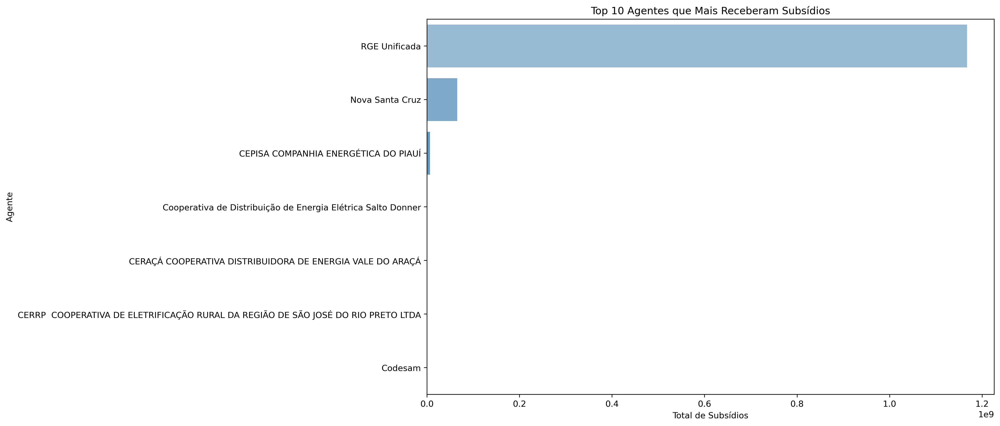
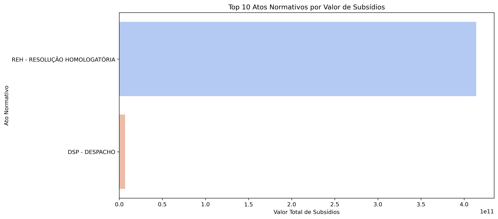
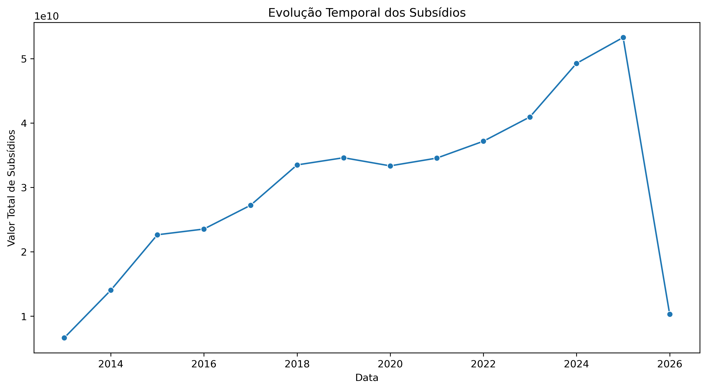

# 📊 Análise de Subsídios Tarifários

Este projeto realiza uma análise detalhada dos subsídios tarifários no setor elétrico brasileiro, utilizando dados disponibilizados pela ANEEL. Foram realizadas etapas de tratamento, análise exploratória e visualização dos dados para identificar os principais agentes, tipos de subsídios, atos normativos e evolução temporal.

## 🔍 Objetivo

Investigar e apresentar:
- Os principais agentes beneficiados.
- Os atos normativos mais utilizados.
- A evolução temporal dos subsídios.

## 🗂️ Estrutura do Projeto

analise_subsidios_tarifarios/
│
├── dados/

│ └── subsidios-tarifarios.csv

│

├── imagens/

│ ├── top10_agentes_subsidios.png

│ ├── top10_atos_normativos.png

│ └── evolucao_subsidios.png

│

├── notebooks/

│ └── analise_subsidios.ipynb

│

└── README.md


## 📈 Principais Gráficos

- **Top 10 Agentes com Maior Valor de Subsídio:**  
  
  
- **Top 10 Atos Normativos:**  
  
  
- **Evolução Temporal dos Subsídios:**  
  

## ⚙️ Tecnologias Utilizadas

- Python (Pandas, Matplotlib, Seaborn)
- Jupyter Notebook

## 💡 Principais Resultados

- Identificação de agentes que concentram grande parte dos subsídios.
- Análise dos atos normativos que mais impactam os subsídios.
- Visualização da evolução temporal dos subsídios.

## 🚀 Como Executar

1. Clone o repositório:
```bash
git clone https://github.com/diegojlfigueredo/analise_subsidios_tarifarios.git
